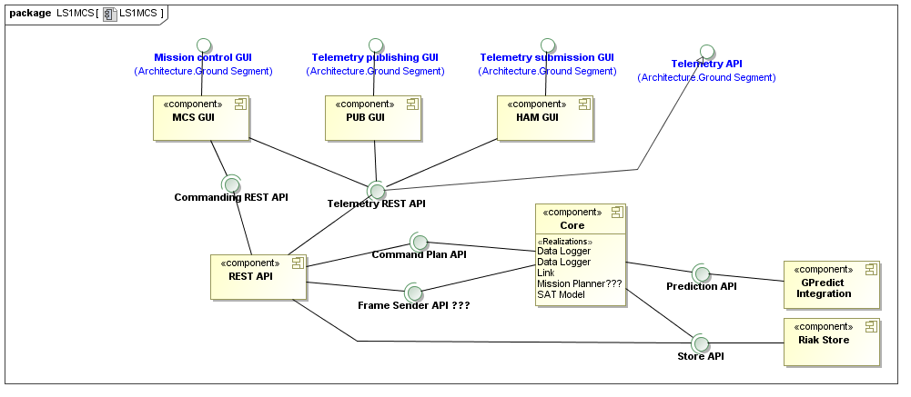
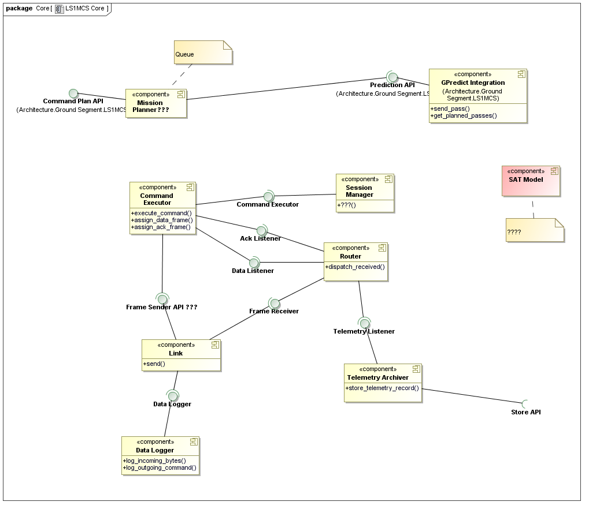
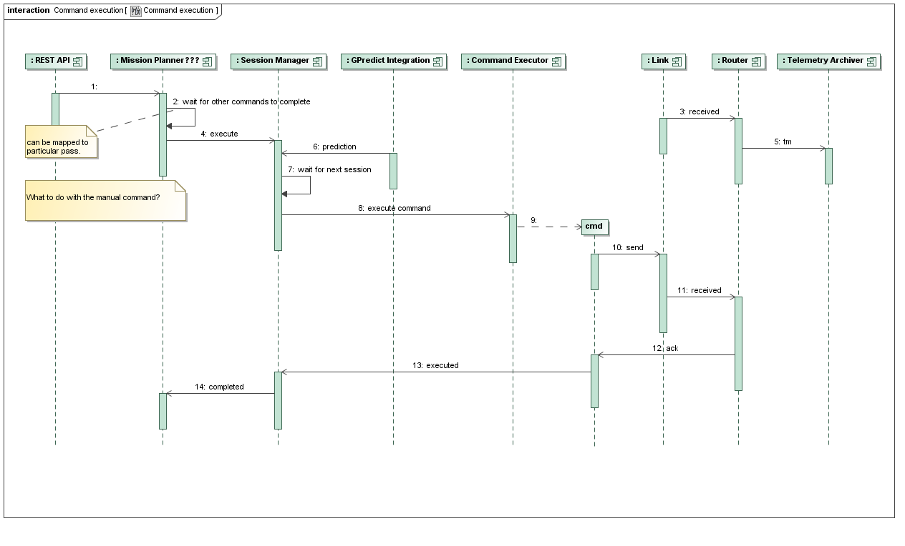
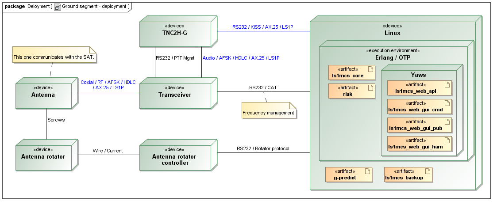

% LS1MCS and Ground Segment Architecture
% Lituanica SAT-1 Team
% 0.01-DRAFT

-------------------------------------------------------------------------------------
Date         Author              Comments
------------ ------------------- ----------------------------------------------------
2013-04-11   K. Petrauskas       Initial revision

2013-04-21   K. Petrauskas       Deployment view updated, MSC decomposition provided.

-------------------------------------------------------------------------------------
Table: Revision history.

Introduction
============

Purpose of the document
-----------------------

Lituanica SAT-1 (LS1) is first Lithuanian satellite.
This document describes architechure of LS1MCS -- Mission Control System (MCS) for the LS1.

Document structure
------------------

This document structured reflecting standard architecture description viewpoints.
The [architecture decisions](#architechure-decisions) section.
More detailed description is provided in following sections.

Editing the document
--------------------

This document is written in Markdown and compiled to PDF using `pandoc` together with `pdflatex`.
Source text of this document can be found in [github](https://github.com/kape1395/ls1mcs/tree/master/docs).

Scope definition
================

Scope of this document is to describe architecture and design of the LS1MCS.
The document also includes high level description of entire Ground Segment.

Protocol used for communicating with the SAT is described in the [separate document](TODO).

Requirements overview
=====================

This section is a bit wider than MCS.
The use cases described here are collected mainly while designing LS1P (LS1 protocol)
therefore mainly covers the SAT and not MCS specifically.

Architecture decisions
======================

This section outlines main architecture decisions.
The ground segment, its interfaces and context is shown in the diagram bellow.

The ground station uses `LS1P` interface (and protocol) to communicate with the "Lituanica SAT-1" and
provide the following interfaces:

Mission control GUI (MCS).
:   A web based user interface allowing to communicate with the SAT. This interface is private and secured.
Telemetry publishing GUI (PUB).
:   A web based user interface for reviewing telemetry archive,
    HAM submitted telemetry and a current state of the SAT.
    This interface is planned to be publicly accessible and provide read access only.
Telemetry submission GUI (HAM).
:   A web based user interface for HAMs to submit telemetry packets as well as to decode them.
    This interface will be publicly available and will have write access to the telemetry database.
Telemetry API.
:   Its a REST api providing programming interface to the telemetry database.
    This interface is planned to be public and will provide read access only.

Main architectural decisions and arguments for them:

Erlang as a platform for the MCS.
:   At the beginning fo the project the [Hummingbird](http://www.hbird.de/) was considered as
    a platform for the Lituanica SAT-1 ground segment implementation. The main concern with
    this software was its stability and predictiveness at operations. The concerns were mostly
    because Apache Camel was used in this solution along with number of ActiveMQ queues.

    The main reason for selecting Erlang based solution instead of one described above is
    stability of the platform. Apart of that, protocols are easy to implement in erlang because
    of great support for finite state machines and binary pattern matching.

Yaws as a web server.
:   Yaws was selected as a web server for implementing REST api as well as for serving WEB GUIs.
    This product was selected because it is Erlang based server (fits well into the stack) and
    the Erlang team of this project had experience with this web server.

Riak as a database.
:   Basho Riak was selected as a database. Its erlang based solution and has good support for binary data.
    Considered alternatives were: Mnesia and PostgreSQL.

JavaScript based GUI.
:   The web based user interfaces are built as single page applications.
    All the user interface is build using JavaScript.
    The user interface access and modifies related data via REST services.
    Three main reasons for this decision:

      * Majority of today's applications provide web interface.
      * JavaScript applications are more interactive than applications based on server side HTML rendering.
      * Its easier to separate user interface (the JavaScript and the HTML part)
        from the business logic (provided by the server side, via Ajax).

Information architecture view
=============================

This section describes information model used in the MCS as well as more detailed data model.
The following diagram shows main entities and relationships between them.

In this diagram:

Command
:   is an order sent (or planned to send) to the satellite.
    Command can have an acknowledgement to it as well as optional response.
Session
:   is a period of active communication with a satellite during single pass.
    Single satellite pass can have several sessions established, but all of them should be serialized.
    I.e. next session can be established only when the previous session is completed.
CommandPlan
:   is a series of commands to be sent to the satellite during one or more sessions.
    Commands are executed in order specified in the plan with optional waiting for acknowledgement
    before proceeding to next command.
PlannedPass
:   stands for a predicted satellite pass trough observation region of the the ground station.
    The predictions are calculated based on NORAD data.
FrameBlock
:   is a series of data frames composing response to a single command.
DataFrame
:   is a single LS1P protocol data frame. Such frames are sent to the ground segment in response to a command.

Functional view
===============

This section describes functional decomposition of the system.

In this diagram:

LS1MCS
:   is an entire mission control system. It provides several interfaces, shown as ports in this diagram.

Riak
:   stands for a database server, used by the MCS to store its runtime data as well as archiving data.

TNC
:   is a terminal node controller. Can work in several modes:

      * Hardware TNC (TNC2H) with WA8DED EPROM implements modem function and AX.25 protocol.
        Proprietary protocol (hostmode) is used in this case for interaction between computer and TNC.
      * Software TNC (Soundmodem) implements modem function only. Computer access this virtual device via KISS protocol.
      * Hardware TNC (TNC2H) with TAPR EPROM. In this scenario, KISS protocol is used for TNC-computer interface.

    In all cases, TNC is vissible to a computer (LS1MCS) via COM port (RS232).

Transceiver
:   Sends and receives packet radio signals via antenna.

G-Predict
:   Used to predict satellite position, control antenna rotator and adjusts transceiver frequences.

The following diagram shows components composing the MCS.

In this diagram:

Core
:   implements main functionality of the MCS. Its internal structure shown in more details bellow.
    LS1MCS Core component provides services for the REST API,
    implements link for communication with the SAT and
    interacts with the satellite pass prediction software.
Riak Store
:   provides persistent storage for the MCS. The `Store` is used by both:
    the `Core` for persisting data and by the `REST API` for data queries.
REST API
:   provides exernalizable API to all the MCS functionality.
    It is used as a backend by all the graphical user interfaces.
    Additionaly, this API is also the ground segment API.
GPredict Integration
:   provides the Core with predicted SAT passes.
    This component uses GPredict exported data as its data source.

The `MCS GUI`, `PUB GUI` and `HAM GUI` components provide all the user interfaces,
prevously introduced in the "Ground segment decomposition" diagram as well as in
the LS1 Ground segment context diagram.
The following diagram shows internal structure of the MCS Core in more details.

The components in this diagram are the follwing:

Data Logger
:   ...
Link
:   ...
Telemetry Archiver
:   ...
Command Executor
:   ...
Response Dispatcher
:   ...
Session Manager
:   ... TODO

Process view
============

TODO: ...

TODO: ...

Deployment view
===============

The LS1MCS is designed to work on Linux. For security reasons the MCS is deployed on several servers.
The following figure shows devices and servers composing the run-time environment for the MCS.

Particular instances composing the MCS as well as communication links between them shown in the following diagram.

As shown in this diagram, the `liepiskes` server will be running in the main mission control centre.
TNC, transceiver and the anthena rotator will be connected to its physically via COM ports.
This server will only run RIAK database, GPredics LS1MCS Core module and the SAT commanding GUI.
The PUB and HAM GUIs are deployed on separate server for security reasons.
For the same reasons, the backup server will be separated from the WEB GUI server.

The `mif-backup` server will have no access to the core server. The data to backup will be pushed to it.
The `mif-web` server will be accessing the `liepiskes` server via REST protocol. The security will be
managed here by using a source host filtering on the `liepiskes` firewall as well as the `web_api` component.

Non functional aspects
======================

ąčęėįšųūžĄČĘĖĮŠŲŪŽ

Summary
=======

